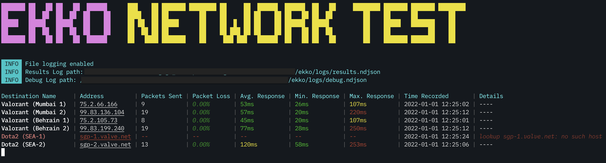

# Ekko
Tool to ping servers (using ICMP & UDP) and track response time and packet loss.

## 📦 Installation
Download the appropriate zip file from [Ekko Releases](https://github.com/soheltarir/ekko/releases) link.

## 🛠 Configuration

The Ekko binary reads configuration from the `config.yaml` file which should reside in the same folder as that of the
binary. By default, the release package comes pre-configured with a `config.yaml` which you could change as per your
requirements.

## 🪀 Usage

### MacOS

1. Unzip the downloaded file in a location of your preference. You can unzip the release using Finder or using Terminal using the
command `unzip ekko-darwin.zip`
2. [Open a terminal](https://support.apple.com/en-in/guide/terminal/apd5265185d-f365-44cb-8b09-71a064a42125/mac) and go the 
installation directory `cd <YourInstallDirectory>/ekko`
3. Ekko requires super admin privileges to run, hence run the program using `sudo ./ekko`
4. Press `control` and `C` to close the program or quit the terminal window.

### Linux

1. Unzip the file in a location of your preference. You can unzip the release using Terminal using the
   command `unzip ekko-darwin.zip`
2. Open a terminal and go the installation directory `cd <YourInstallDirectory>/ekko`
3. Ekko requires super admin privileges to run, hence run the program using `sudo ./ekko`
4. Press `Ctrl` and `C` to close the program or quit the terminal window.
